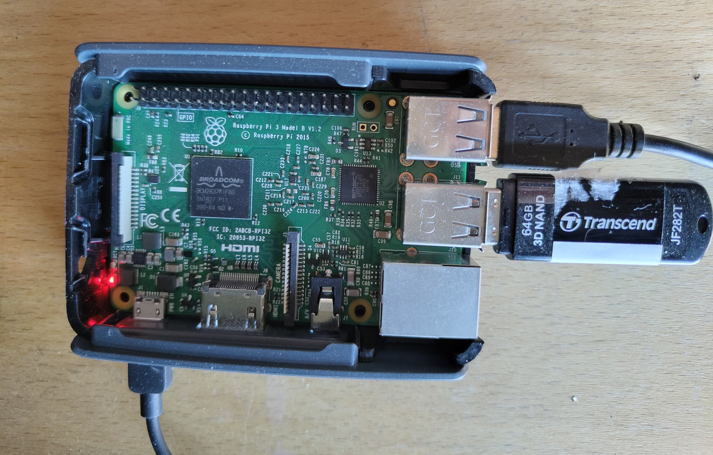

# Página principal
## Bienvenido/a a la documentación de los servicios web de AMSI

!!! info end "Estructura de la docu"
    En esta página encontrarás un resumen del hardware empleado para montar el servidor AMSI y los diferentes servicios instalados. La configuración propia de estos se encuentra en las distintas páginas de la docu.  

## Hardware

Para montar el servidor hemos hecho uso de una Raspberry Pi 3B y un USB de 64GB.

<figure markdown="span">
  { width="500" }
</figure>

Para evitar problemas de estabilidad, en lugar de hacer uso de una tarjeta microSD y un USB, optamos por usar únicamente un USB como sistema raíz `/` para el sistema operativo y almacenamiento para el servidor de partituras. Así luego, de necesitar mayores recursos, la escalabilidad es más sencilla y práctica.

