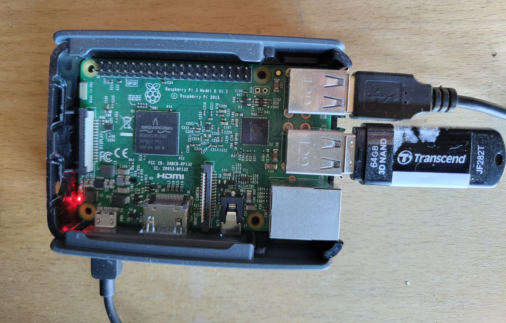

# Pàgina principal

!!! info end "Sobre la docu"
    Encara es troba en construcció i, segons es vaja avançant i es vagen implementant noves tecnologies, s'aniran afegint.

## Benvingut/da a la documentació dels serveis web d'AMSI

!!! abstract end "Estructura de la docu"
    En esta pàgina trobaràs un resum del maquinari emprat per a muntar el servidor AMSI i els diferents servicis instal·lats. La configuració pròpia d'estos es troba en les diferents pàgines de la docu. 

## Hardware

Per a muntar el servidor hem fet ús d'una Raspberry Pi 3B i un USB de 64GB.

<figure markdown="span">
  { width="500" }
</figure>

Per a evitar problemes d'estabilitat, en lloc de fer ús d'una targeta microSD i un USB, optem per usar únicament un USB com a sistema arrel `/` per al sistema operatiu i emmagatzematge per al servidor de partitures. Així, de necessitar majors recursos, l'escalabilitat és més senzilla i pràctica.

## Software

### Programari executat en la raspi

- **Seafile:** Emmagatzematge lleuger per a les partitures.
- **Wireguard:** Servidor d'VPN.
- **Postfix:** Encaminament i enviament de correu electrònic.
- **Dovecot:** Emmagatzematge i gestió del correu entre els clients.

### Altres serveis
- **GitHub Pages:** Hosting públic dels arxius de les pàgines webs associades al domini [amsantisidre.es](https://amsantisidre.es)

## Contacte

Si tens alguna pregunta o suggeriment, no dubtes a posar-te en contacte amb nosaltres! [webamsi@amsantisidre.es](mailto://webamsi@amsantisidre.es)